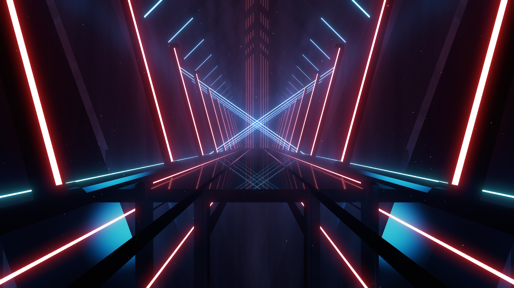

# Environment Enhancement

Script to deal with environment enhancement.

## How to use

**For Players:** Drop `<ENVIRONMENT>.dat` into `<PATH_TO_BEAT_SABER>/UserData/Chroma/Environments/`.

**For Mappers:** Environment is designed for beatmap V3 as it uses Chroma component, copy the
`environment` inside `<ENVIRONMENT>.dat` and place it into `customData`. Copy `materials` if it
exist too.

## Gallery

### [Torii](./torii/) (Vanilla-compatible)

#### Based on Billie Environment

Used in Genryuu Kaiko

### [Lotus](./lotus/) (Vanilla-compatible)

#### Based on BTS Environment

Used in Vagueness & JOURNEY

### [Vapor Frame](./vapor-frame/) (Partial Vanilla Support)

#### Based on Big Mirror Environment

**Original design by Liquid Popsicle**

Used in [Listen Up](https://youtu.be/L9ZixwKNlcU)

### [Prayers](./prayers/) (Partial Vanilla Support)

**Original design by Halcyon12**

Used in Clockup Flowers

### [Big Mirror V2](./bmv2/) (Partial Vanilla Support)

#### Based on Big Mirror Environment

**Original design by Liquid Popsicle**

Used in [Warg](https://youtu.be/23Zpmpfy9C0)

### [ECHO](./echo/) (Partial Vanilla Support)

#### Based on KDA Environment

Used in [ECHO](https://youtu.be/99Z7XqKOnOw)

### [Cathedral](./cathedral/) (Vanilla-compatible)

#### Based on BTS Environment

### [Requiem](./requiem/) (Vanilla-compatible)

#### Based on Panic Environment

very lame first environment enhancement

