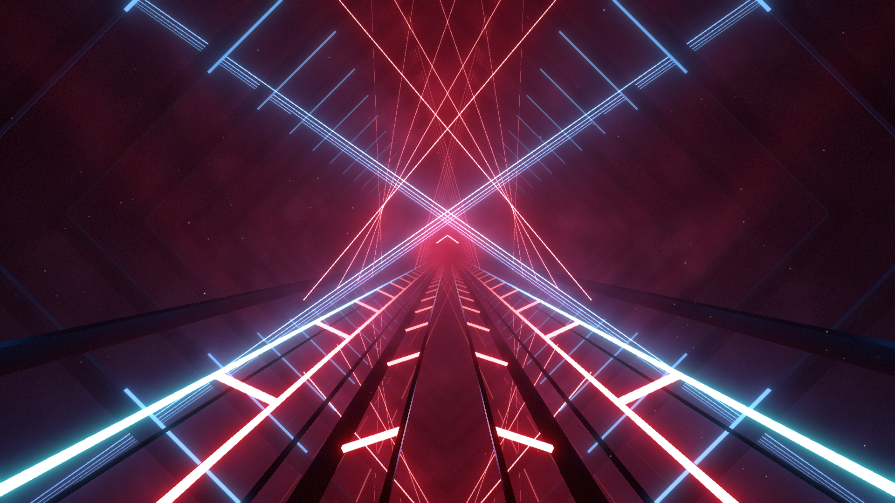

# Big Mirror v2 Environment

## Partially-compatible with vanilla lighting

Used in [Warg](https://youtu.be/23Zpmpfy9C0)



### Event Light ID

```haskell
Backtop Light (Type 0) : 1 -> 20
Extra Front Light (Type 0) : 101 -> 120
Inner Road Light (Type 4) : 101 -> 140
Outer Road Light (Type 4) : 141 -> 180
```
