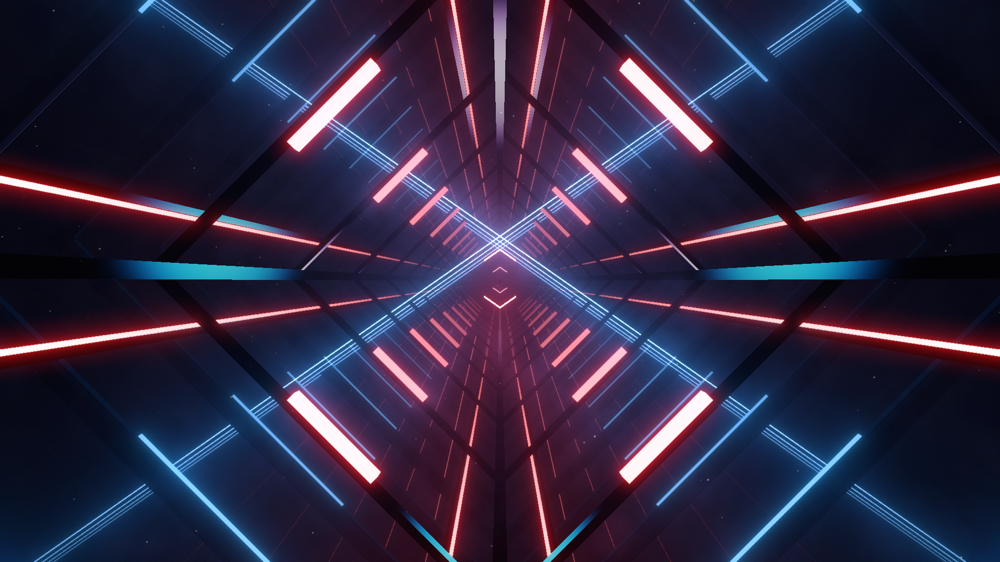

# Vapor Frame Environment

## Partially-compatible with vanilla lighting

Used in [Listen Up](https://youtu.be/L9ZixwKNlcU)



### Event Light ID

```haskell
Backtop Light (Type 0) : 1 -> 20
Inner Ring Light (Type 4) : 101 -> 120
```
